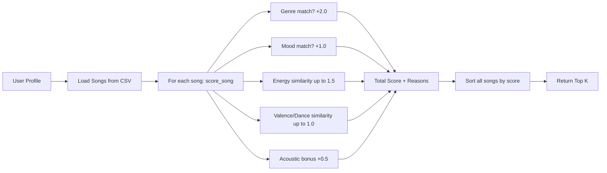

# 🎵 Music Recommender Simulation

## Project Summary

VibeFinder 1.0 is a content-based music recommender that scores songs against a user's taste profile using weighted feature matching. It loads a catalog of 18 songs from CSV, computes a similarity score for each song based on genre, mood, energy, valence, danceability, and acousticness, then ranks and returns the top-k recommendations with human-readable explanations.

---

## How The System Works

Real-world recommender systems (like Spotify or YouTube) use massive datasets, collaborative filtering ("users like you also liked..."), and deep learning models. Our simulation simplifies this to a **content-based** approach: we compare the features of each song directly to the user's stated preferences and assign a numeric score.

### Features Used

**Song features** (from `data/songs.csv`):
- `genre` — categorical (pop, lofi, rock, ambient, jazz, synthwave, indie pop, R&B, hip-hop, classical, country, metal, reggae, folk, EDM)
- `mood` — categorical (happy, chill, intense, relaxed, moody, focused, soulful, confident, melancholy, nostalgic, aggressive, uplifting, reflective, euphoric)
- `energy` — numerical 0.0–1.0 (intensity level)
- `valence` — numerical 0.0–1.0 (musical positivity)
- `danceability` — numerical 0.0–1.0 (rhythmic suitability for dancing)
- `acousticness` — numerical 0.0–1.0 (organic vs. electronic sound)

**UserProfile stores**:
- `favorite_genre` — target genre string
- `favorite_mood` — target mood string
- `target_energy` — preferred energy level (0.0–1.0)
- `target_valence` — preferred valence level (0.0–1.0)
- `target_danceability` — preferred danceability (0.0–1.0)
- `likes_acoustic` — boolean flag for acoustic preference

### Algorithm Recipe (Scoring Rule)

For each song, the system computes a score using these rules:

| Rule | Points | Description |
|------|--------|-------------|
| Genre match | +2.0 | Exact genre string match |
| Mood match | +1.0 | Exact mood string match |
| Energy similarity | up to +1.5 | `(1 - \|song_energy - target_energy\|) × 1.5` |
| Valence similarity | up to +0.5 | `(1 - \|song_valence - target_valence\|) × 0.5` |
| Danceability similarity | up to +0.5 | `(1 - \|song_dance - target_dance\|) × 0.5` |
| Acoustic bonus | +0.5 | If user likes acoustic AND song acousticness > 0.5 |

**Maximum possible score**: ~6.0 (all matches + perfect numerical alignment + acoustic bonus)

### Ranking Rule

After scoring every song, the system sorts all songs by score in descending order and returns the top-k results. We use `sorted()` (returns a new list) rather than `.sort()` (mutates in-place) to preserve the original catalog.

### Data Flow

```
User Prefs → [Loop over all songs] → score_song() → (score, reasons) → Sort descending → Top K Recommendations
```



### Potential Biases

- **Genre dominance**: At +2.0 points, a genre match can override all other features, causing the system to recommend songs that match genre but feel wrong in mood or energy.
- **Catalog imbalance**: With 3 lofi songs and only 1 each of classical/metal/reggae/folk, the system has more opportunities to match lofi preferences.
- **Binary matching**: Genre and mood are exact-match only — "indie pop" won't match "pop" even though they're related.

---

## Getting Started

### Setup

1. Activate the conda environment:

   ```bash
   conda activate quantenv
   ```

2. Run the app:

```bash
python -m src.main
```

### Running Tests

Run the starter tests with:

```bash
pytest
```

You can add more tests in `tests/test_recommender.py`.

---

## Experiments You Tried

### Experiment 1: Weight Shift — Double Energy, Half Genre

We doubled the energy weight (1.5→3.0 multiplier) and halved the genre weight (2.0→1.0) for the "Pop/Happy" profile.

**Result**: "Rooftop Lights" (indie pop, happy, energy=0.76) jumped from #3 to #2, while "Gym Hero" (pop, intense, energy=0.93) dropped from #2 to #3. The higher energy weight rewarded songs with closer energy values, even without a genre match. This shows that genre dominance can mask energy mismatches — "Gym Hero" is pop but its intense mood doesn't fit a "happy" profile, yet the original genre bonus pushed it above mood-matching songs.

### Experiment 2: Diverse Profile Testing

We tested 5 distinct profiles:

- **High-Energy Pop**: Correctly surfaces "Sunrise City" and "Gym Hero" — both pop, high energy.
- **Chill Lofi**: Correctly surfaces "Library Rain" and "Midnight Coding" — both lofi, chill, low energy, acoustic.
- **Deep Intense Rock**: Correctly surfaces "Storm Runner" as #1 (rock, intense, high energy).
- **Conflicting Profile (High Energy + Sad)**: This adversarial case shows the tension — lofi genre match pulls in low-energy songs, while the mood "intense" and high energy target favor rock/pop. The lofi genre bonus dominates, producing recommendations that don't truly match the conflicting intent.
- **Acoustic Jazz Lover**: Correctly surfaces "Coffee Shop Stories" (jazz, relaxed, acoustic) as #1.

---

## Limitations and Risks

- **Tiny catalog**: 18 songs is far too small for meaningful recommendations; real systems use millions.
- **No collaborative filtering**: We only compare features, not "users who liked X also liked Y."
- **Binary categorical matching**: Genre and mood must match exactly — "indie pop" ≠ "pop", "chill" ≠ "relaxed".
- **Genre weight dominance**: At +2.0, genre can override mood and energy, creating filter bubbles.
- **No temporal awareness**: The system doesn't consider listening history or variety in recommendations.
- **No lyrics or cultural context**: The system is deaf to language, themes, or cultural significance.

See [model_card.md](model_card.md) for a deeper analysis.

---

## Reflection

Read and complete `model_card.md`:

[**Model Card**](model_card.md)

Building this recommender revealed how even simple scoring rules can produce results that "feel" like real recommendations. The biggest surprise was how the genre weight (+2.0) consistently overpowered other features — "Gym Hero" kept appearing for happy pop listeners simply because it shares the genre, even though its intense mood is a poor fit. This mirrors real-world filter bubbles where algorithmic over-weighting of one signal narrows what users see. The conflicting profile experiment was especially illuminating: when preferences contradict each other (high energy + lofi), the system defaults to whichever feature carries more weight rather than recognizing the tension. In real systems, this kind of bias could systematically ignore users with complex or evolving tastes.


